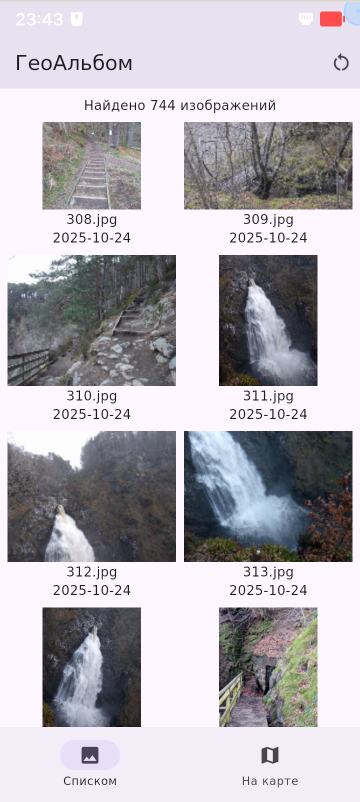

# GeoAlbum — Географический фотоальбом для Aurora OS


**GeoAlbum** - мобильное приложение на **Flutter** для **Aurora OS**, разработанное в рамках олимпиады по программированию.  
Приложение извлекает геоданные из фотографий, отображает их на карте и в галерее, поддерживает навигацию между экранами.

---

## Функциональность

- **Экран галереи**  
  Плиточное отображение фотографий из `~/Pictures` (JPEG, PNG).  
  Переход на экран просмотра по тапу.
  
- **Экран просмотра фотографии**  
  Полноэкранный просмотр с зумом (`InteractiveViewer`).  
  Информация: путь, дата, координаты.  
  Кнопки: «Закрыть», «Показать на карте»
  Предупреждение, если геоданные отсутствуют.

- **Экран карты**  
  Карта на OpenStreetMap (`flutter_map`).  
  Маркеры и кластеры (`flutter_map_marker_cluster`) - только фото с GPS.  
  Тап по маркеру → переход на просмотр.  

- **Навигация**  
  `NavigationBar` - переключение между галереей и картой.  
  Полная цепочка переходов: **Галерея ↔ Просмотр ↔ Карта ↔ Галерея**.

---

## Скриншоты

| Экран галереи | Экран карты | Экран просмотра |
|---------------|--------------------------|------------------|
|  |  |  |

> *Скриншоты сделаны на эмуляторе Aurora OS*

---

## Технологии

| Компонент | Пакет |
|---------|-------|
| Карты | `flutter_map`, `flutter_map_marker_cluster` |
| Состояние | `provider` |
| EXIF | `exif` |
| Локализация | Русский язык |
| UI | Material 3 (`useMaterial3: true`) |

---

### Запуск

```bash
git clone https://github.com/simbirskiif/aurora-geoalbum-flutter.git
cd aurora-geoalbum-flutter
flutter pub get
flutter run
